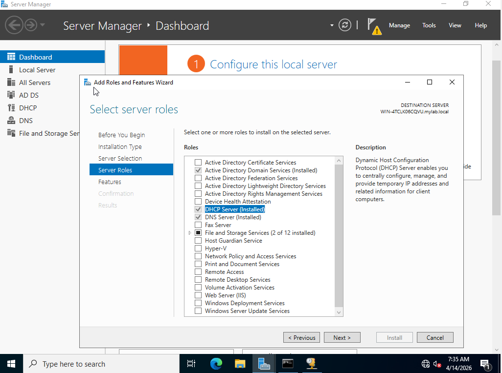
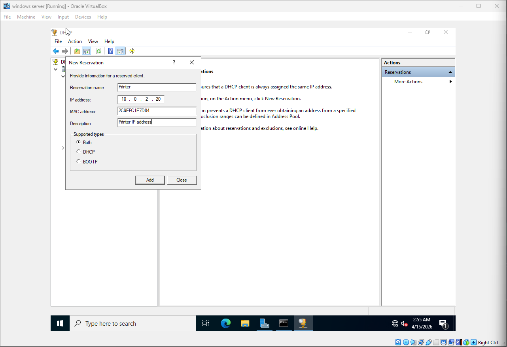
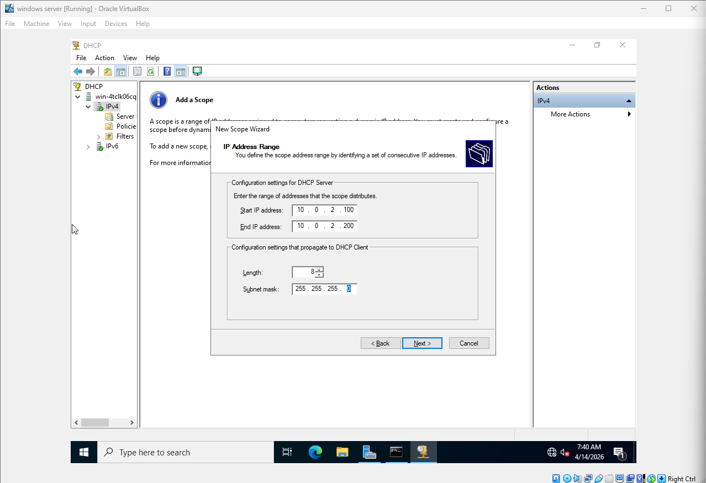
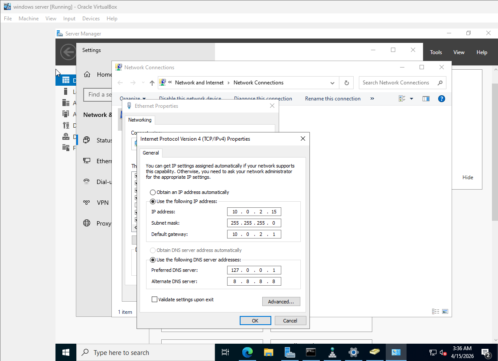
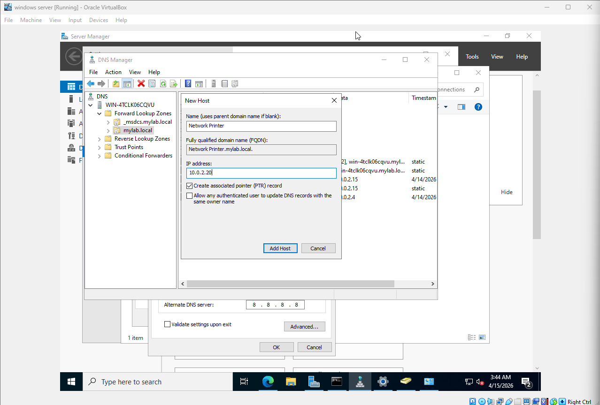

# 🖥️ Active Directory, DHCP & DNS — Home Lab Documentation

## Overview
Built a home lab simulating a real enterprise environment using Oracle VirtualBox. Configured a Windows Server 2022 Domain Controller alongside a Windows 10 client machine, then deployed and tested Active Directory, DHCP, and DNS services.

---

## 🏗️ Lab Setup

Two virtual machines were created:
- **Windows Server 2022** — Acts as the Domain Controller
- **Windows 10** — Acts as the client machine

 

---

## 🔧 Configuration Steps

### 1. Creating a NAT Network in VirtualBox
Created a shared NAT Network (`NatNetwork`, `10.0.2.0/24`) so both VMs could communicate with each other.

 

---

### 2. Connecting Both VMs to the Same Network
Set both the Windows Server and Windows 10 VMs to use the same `NatNetwork` adapter, then updated the DNS server on the Windows 10 machine to point to the server's IP.

 

---

### 3. Joining the Client to the Domain
On the Windows 10 VM, navigated to **System > Advanced Settings** and joined the `mylab.local` domain. The machine was renamed `WORK-0001`.

 

---

### 4. Remote Computer Management
After joining the domain, accessed **Computer Management** on the Windows 10 machine remotely from the server — demonstrating centralized administration.

 

---

### 5. Group Policy — HR Group
Created an HR security group in Active Directory with specific restrictions and software permissions. Group Policy Objects allow administrators to apply different rules to different departments.

 

---

### 6. Installing DHCP on Windows Server
Installed the **DHCP Server** role via Server Manager's Add Roles and Features Wizard.

 

---

### 7. Creating a DHCP Scope
Created a new scope with an IP address range of `10.0.2.100` – `10.0.2.200` to dynamically assign addresses to clients on the network.

 

---

### 8. DHCP Reservation — MAC Address Binding
Created a DHCP reservation to permanently assign IP `10.0.2.20` to a device (simulated printer) using its MAC address, ensuring it always receives the same IP.

 

---

### 9. Assigning a Static IP to the Domain Controller
Configured the Windows Server's NIC with a static IP (`10.0.2.15`) and set it as the DNS server for the `mylab.local` domain, ensuring reliable name resolution for all clients.

 

---

### 10. Creating a DNS A Record
In DNS Manager, created an A record mapping `NetworkPrinter.mylab.local` → `10.0.2.20`, with an associated PTR record for reverse lookup.

 

---

## 🧠 Configuration Summary

| Service | Task | Detail |
|---------|------|--------|
| Active Directory | Domain setup | `mylab.local` forest, DC on Windows Server 2022 |
| Active Directory | Client join | `WORK-0001` joined to `mylab.local` |
| Active Directory | Group Policy | HR group with custom restrictions |
| DHCP | Scope | `10.0.2.100` – `10.0.2.200` |
| DHCP | Reservation | Printer bound to `10.0.2.20` via MAC |
| DNS | Static IP | Server at `10.0.2.15` |
| DNS | A Record | `NetworkPrinter.mylab.local` → `10.0.2.20` |

---

## 📋 Skills Demonstrated
- Active Directory Domain Services setup and domain join
- Group Policy Object (GPO) creation and group management
- DHCP scope configuration and MAC-based reservations
- DNS A record and PTR record creation
- VirtualBox NAT network configuration for VM-to-VM communication
- Remote server administration (RSAT)

---

## 🛠️ Tools & Technologies

 
