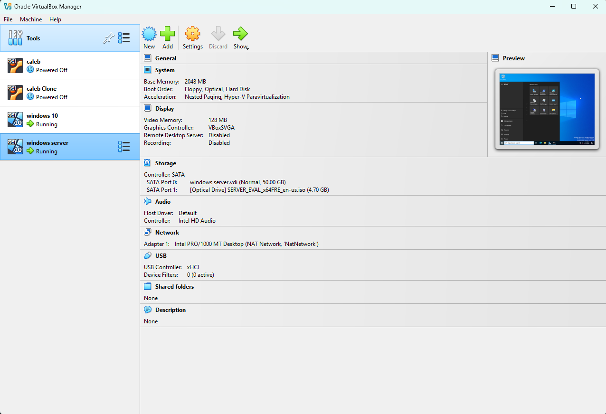
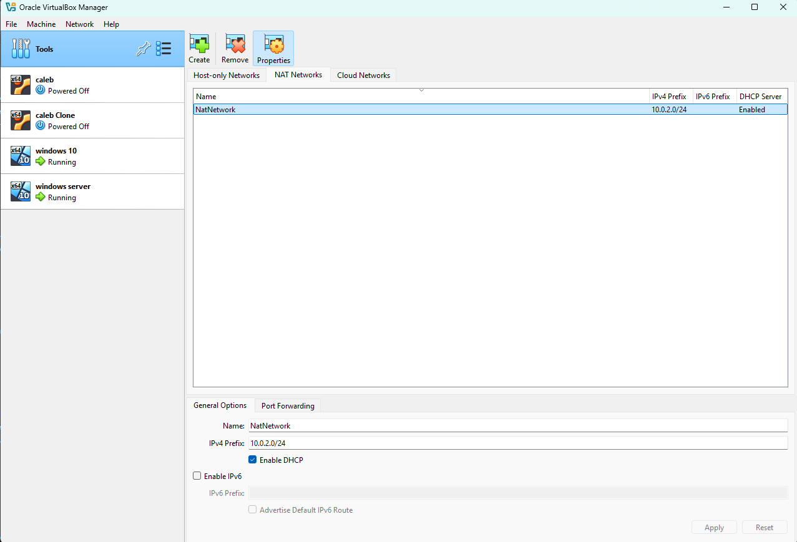
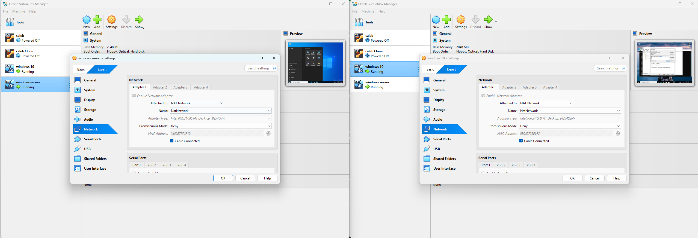
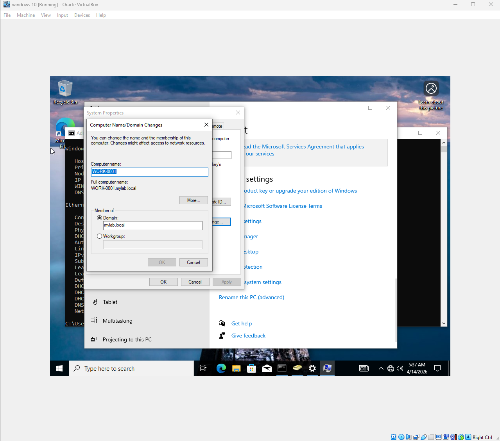
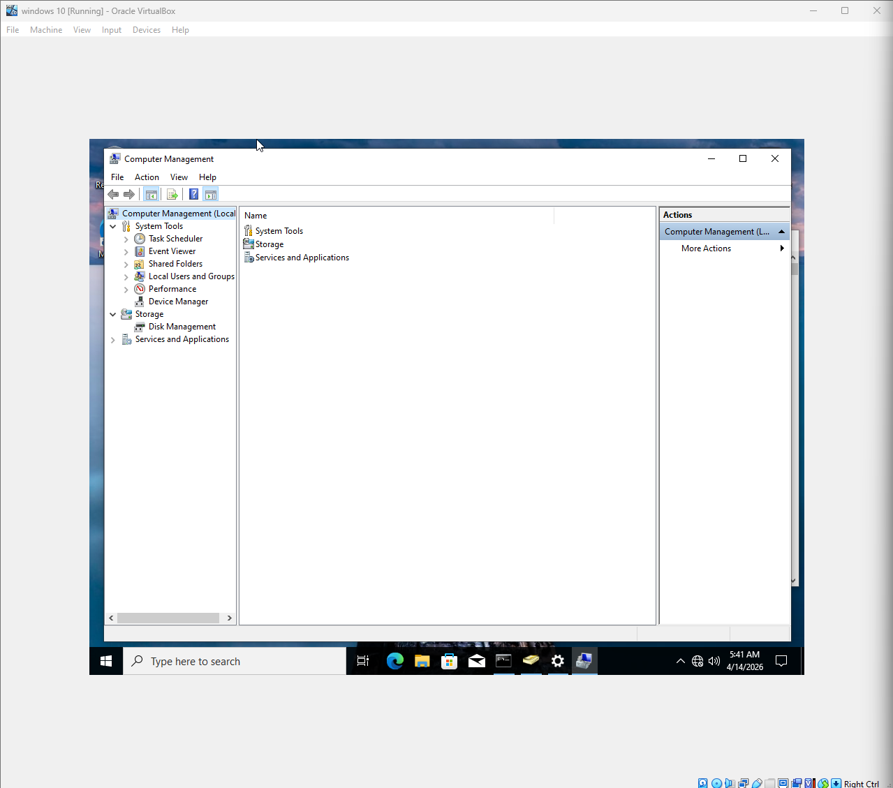
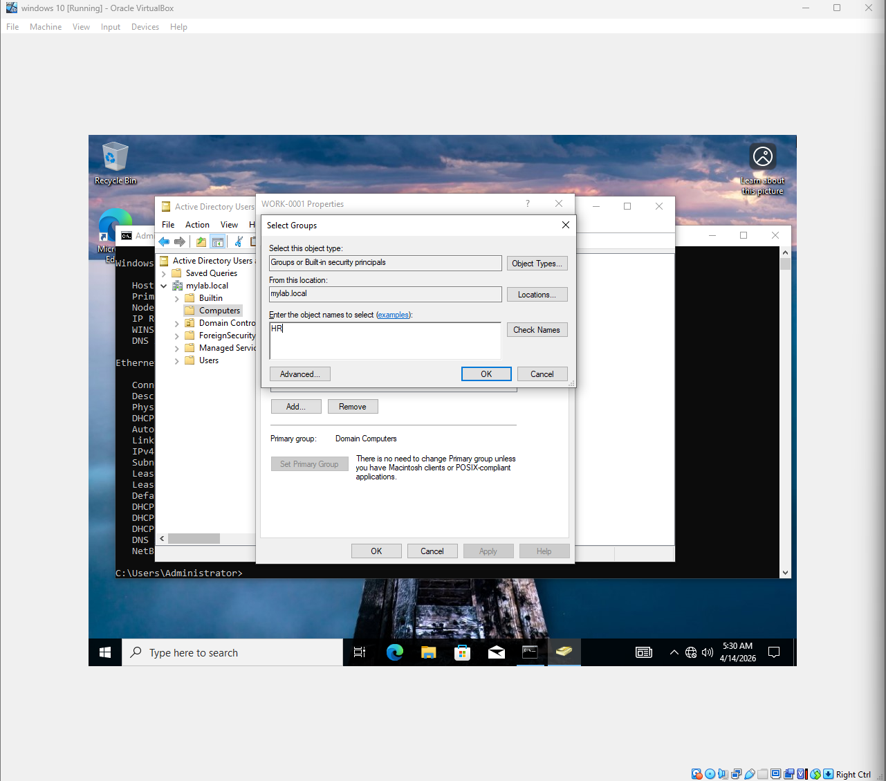

Active Directory, DHCP & DNS – Home Lab Documentation

What is Active Directory?

Active Directory (AD) is a directory service developed by Microsoft that acts as a centralized system for managing users, computers, and resources within a network. It allows administrators to control access, apply security policies, and manage all devices from one place.

Lab Setup

To simulate a real enterprise environment, I created two virtual machines. 
-One running Windows Server 2022 which acts as the Domain Controller 
-One running Windows 10 which acts as the client machine.

Installing Remote Server Administration Tools (RSAT)
Before managing Active Directory from the client machine, I installed the Remote Server Administration Tools on the Windows 10 VM. This gave me access to the Active Directory Users and Computers console.

Installing Active Directory Domain Services

On the Windows Server VM, I installed the Active Directory Domain Services role through Server Manager and promoted the server to a Domain Controller, creating a new forest with the domain mylab.local.

Connecting the Two VMs

Initially the Windows 10 machine could not reach the domain controller due to a network configuration issue. I resolved this by:
-Creating a Nat network in VirtualBox     
-Setting both VMs to the same Nat Network in VirtualBox    
-Updating the DNS server address on the Windows 10 machine to point to the server's IP address.

Joining the Domain
On the Windows 10 VM I navigated to System Advanced Settings and changed the domain to mylab.local, successfully joining the client machine to the domain.

Creating a User Account

On the Windows Server I opened Active Directory Users and Computers and created a new user named Caleb, granting it administrative privileges on the domain.

Remote Computer Management

After joining the domain I was able to access Computer Management on the Windows 10 machine remotely from the server, demonstrating centralized management capabilities. 

Group policy object

In my domain computer i added a new group called HR which has certain restrictions and ability to intall new software. This is very usefull and allows me to group people working togerther depending on what restrictions and accesses they need.  

DYNAMIC HOST CONFIGURATION PROTOCOL

SCOPE - IP address range that is used for a DHCP server
To create a new scope i had to:
- install DHCP on my windows server
- create the new scope

Address Pool – The range of IP addresses available to be leased out to clients (e.g., 10.0.2.0 range).

Address Leases – Shows currently active leases; which clients have been assigned an IP, their hostnames, and lease expiration times.

Reservations – Lets you permanently assign a specific IP to a device based on its MAC address, so it always gets the same IP.

next is to assigh an IP address to a specific mac-address through DHCP
`

